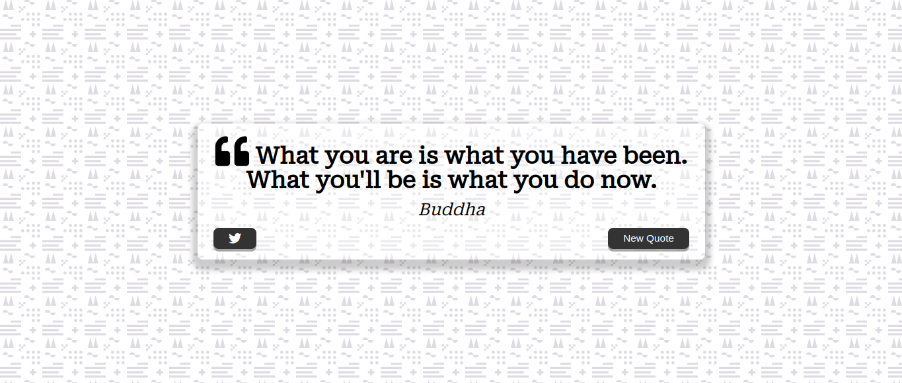
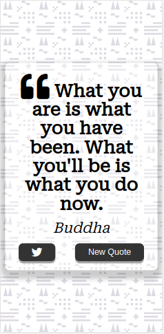

# quote-generator

---

## Course Reference: <a href="https://academy.zerotomastery.io/p/javascript-projects" target="_blank" title="ZTM Website"> 20 JavaScript Portfolio Projects with Zero to Mastery</a>

## Quote Generator's features
- Fetching Data 
- DOM Manipulation 
- JavaScript Loading Animation
- 

---

### Resources:
- <a href="https://heropatterns.com/" target="_blank">Hero Patterns</a>
- <a href="https://cdnjs.com/libraries/font-awesome" target="_blank">Font Awesome Libraries</a>
- <a href="https://fontawesome.com/" target="_blank">Font Awesome</a>
- <a href="https://fonts.google.com/" target="_blank">Google Fonts</a>
- <a href="https://academy.zerotomastery.io/p/javascript-projects" target="_blank">ZTM 20 JavaScript Porjects</a>
- <a href="https://github.com/JacintoDesign/quote-generator" target="_blank">Github Quote Generator - Jacinto Design</a>
- <a href="https://type.fit/api/quotes" target="_blank">Quotes API</a>
- <a href="https://twitter.com/intent/tweet" target="_blank">Web Intent URL</a>
- <a href="https://www.w3schools.com/howto/howto_css_loader.asp" target="_blank">W3C: How to make a loader</a>